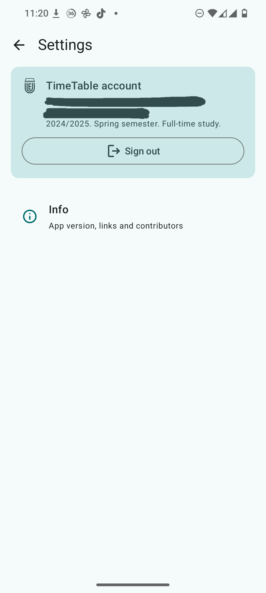
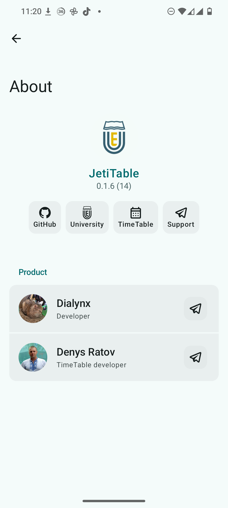

<h1 align="center">
  
   
 JetiTable
</h1>

 
    English |
    <a href="docs/README.ua.md">Українська</a>

An open source application for the TimeTable scheduling information system

JetiTable is an open source application for the TimeTable scheduling information system, supporting Android 7.0 and higher.

> [!IMPORTANT]
> This is NOT an officially supported product by the university

## Features
- Class (including presence verification) and exam schedule
- Event reminders
- Attendance log

## Screenshots
    

## Downloads
[GitHub](https://github.com/thisdialynx/JetiTable/releases/latest) and [SourceForge](https://sourceforge.net/projects/diaproduction/files/JetiTable/) is the only source at the moment

## Translation contributions
Default string resources are located here:
- `/app/src/main/res/values/strings.xml`

Translate each and place them in the respective locations (`app/src/main/res/values-[lang]/strings.xml`)

## Bug reports 
#### Only bug reports that come from the debug build will be accepted.

## Links
- [Official site of the university](https://snu.edu.ua/index.php/en/home-english/)
- [TimeTable schedule system](https://timetable.lond.lg.ua/)

## Credits
- [icons8](https://icons8.com/icons) for icons
- [Valkyrie](https://github.com/ComposeGears/Valkyrie) for Compose ImageVector generation from SVG/XML
